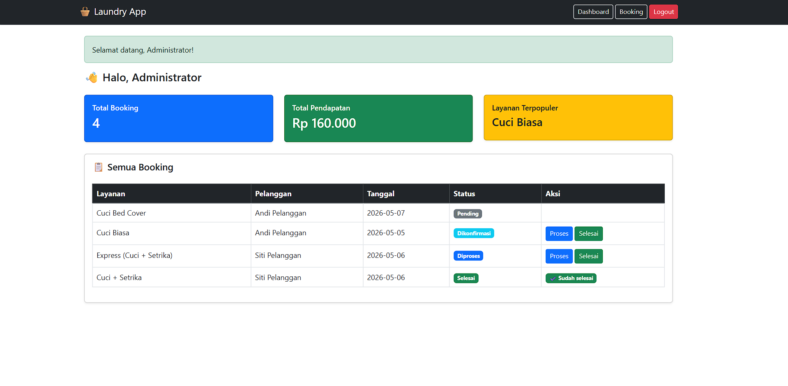
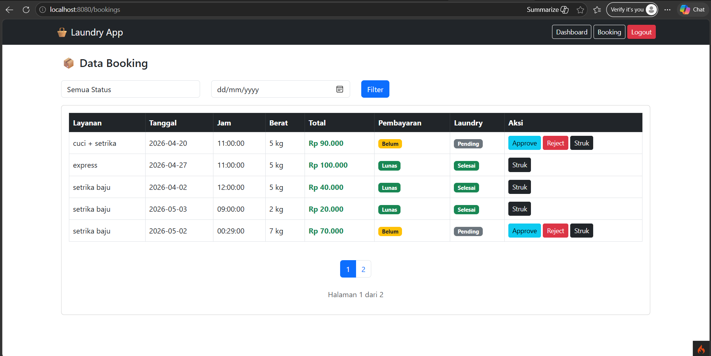
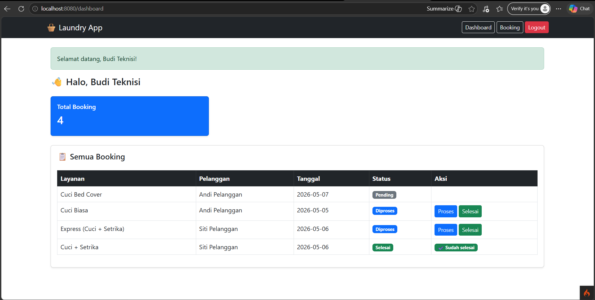
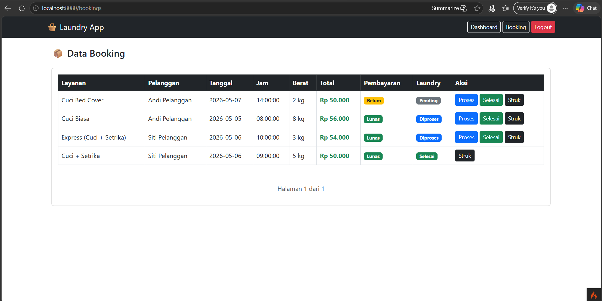
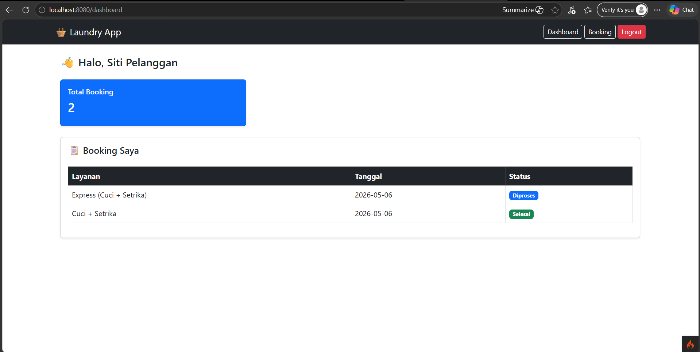
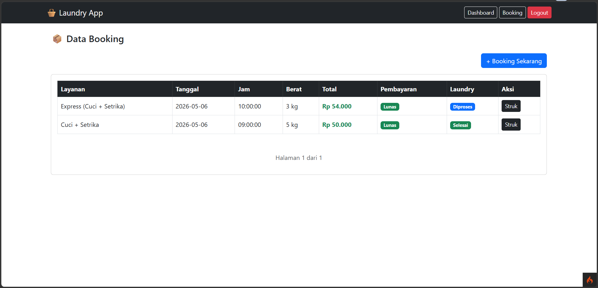
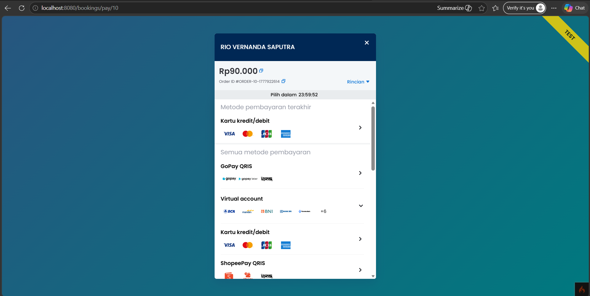

# 🧺 Laundry Booking App (CodeIgniter 4)

## 📌 Deskripsi

Aplikasi web untuk pemesanan layanan laundry menggunakan **CodeIgniter 4**.
Pengguna dapat melakukan booking, memilih layanan & jadwal, serta melakukan pembayaran online melalui **Midtrans**.
Admin dan staff dapat mengelola layanan, jadwal, serta memonitor status laundry.

---

## 🎯 Tujuan Project

Project ini dibuat untuk memenuhi tugas **Pemrograman Web Lanjut (CodeIgniter 4)** dengan implementasi:

* MVC (Model-View-Controller)
* Authentication & Authorization
* Payment Gateway (Midtrans)
* REST API

---

## 🚀 Fitur Utama

### 🔐 Authentication & Authorization

* Login & Register
* Multi-role:

  * **Admin**
  * **Staff**
  * **Pelanggan**
* Proteksi route menggunakan **Filter CI4**

---

### 📦 Booking System

* Booking layanan laundry
* Input berat cucian
* Pilih jadwal
* Perhitungan harga otomatis
* Status:

  * Pending
  * Diproses
  * Selesai

---

### 💳 Payment Gateway (Midtrans)

* Integrasi **Midtrans Snap (Sandbox)**
* Popup pembayaran
* Redirect halaman finish
* Callback / webhook
* Update status otomatis setelah pembayaran

---

### 🧾 Admin Panel

* CRUD layanan laundry
* CRUD jadwal
* Manajemen booking
* Update status laundry

---

### 👨‍🔧 Staff Panel

* Melihat daftar booking
* Update status laundry

---

### 👤 User Panel

* Booking laundry
* Melihat riwayat booking
* Melakukan pembayaran

---

### 📊 Dashboard

* Total booking
* Total pendapatan
* Statistik layanan

---

### 🌐 API Endpoint

| Method | Endpoint                 | Deskripsi      |
| ------ | ------------------------ | -------------- |
| GET    | /api/services            | List layanan   |
| GET    | /api/booking-status/{id} | Status booking |

---

## 🛠️ Teknologi

* **Framework**: CodeIgniter 4
* **Database**: MySQL
* **Frontend**: Bootstrap 5
* **Payment**: Midtrans Sandbox

---

## ⚙️ Instalasi

### 1. Clone Repository

```bash id="clone1"
git clone https://github.com/riovernandvernand-cyber/laundry-app.git
cd laundry-app
```

---

### 2. Install Dependency

```bash id="install1"
composer install
```

---

### 3. Setup Environment

```bash id="env1"
cp env .env
```

Edit `.env`:

```env id="env2"
database.default.hostname = localhost
database.default.database = db_laundry
database.default.username = root
database.default.password =
database.default.DBDriver = MySQLi
```

---

### 4. Migration & Seeder

```bash id="migrate1"
php spark migrate --seed
```

---

### 5. Jalankan Server

```bash id="serve1"
php spark serve
```

Akses aplikasi:
👉 http://localhost:8080

---

## 👤 Akun Demo

### 👑 Admin

* Email: [admin@laundry.com](mailto:admin@laundry.com)
* Password: admin123

### 👨‍🔧 Staff

* Email: [staff@laundry.com](mailto:staff@laundry.com)
* Password: staff123

### 👤 User

* Email: [siti@gmail.com](mailto:siti@gmail.com)

* Password: user123

* Email: [andi@gmail.com](mailto:andi@gmail.com)

* Password: user123

### ❌ User Nonaktif

* Email: [dewi@gmail.com](mailto:dewi@gmail.com)
* Password: user123
* Status: Tidak bisa login

---

## 💳 Konfigurasi Midtrans

Tambahkan ke `.env`:

```env id="mid1"
MIDTRANS_SERVER_KEY=your_server_key
MIDTRANS_CLIENT_KEY=your_client_key
MIDTRANS_IS_PRODUCTION=false
```

---

## 🗄️ Database

Database menggunakan:

* Migration
* Seeder

Jalankan:

```bash id="db1"
php spark migrate --seed
```

---

## 📊 ERD


---

## 📸 Screenshot

### 👨‍💼 Admin




---

### 👨‍🔧 Staff




---

### 👤 User






---

## 📦 Struktur Folder (Simplified)

```bash id="struct1"
app/
 ├── Controllers/
 ├── Models/
 ├── Views/
public/
screenshots/
```

---

## 🔒 Keamanan

* Password di-hash menggunakan `password_hash()`
* Proteksi route dengan Filter CI4
* Validasi input user

---

## 📦 Deployment Notes

* File `.env` tidak disertakan
* Gunakan `.env.example`
* Pastikan PHP >= 8.0
* Pastikan ekstensi:

  * intl
  * mbstring
  * mysqli

---

## 🚀 Future Improvement

* Notifikasi WhatsApp
* Upload bukti pembayaran
* Sistem promo / diskon
* Laporan PDF

---

## 👨‍💻 Author

**Rio Vernand**

Project ini dibuat untuk memenuhi tugas
📚 *Pemrograman Web Lanjut (CodeIgniter 4)*

---
