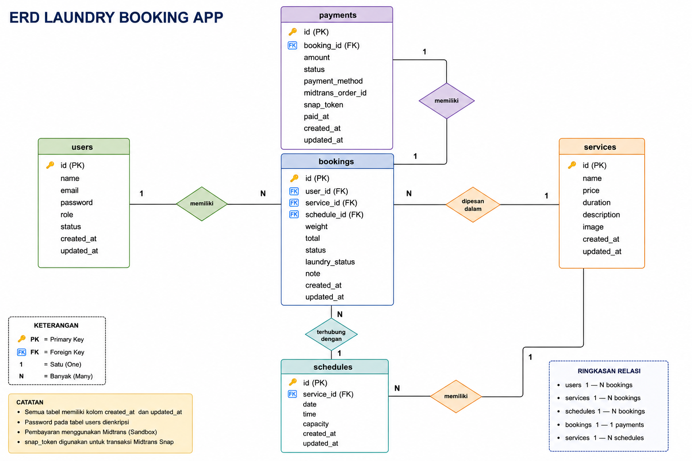

# 🧺 Laundry Booking App (CodeIgniter 4)

## 📌 Deskripsi

Aplikasi pemesanan layanan laundry berbasis web menggunakan CodeIgniter 4.
Sistem ini memungkinkan pelanggan melakukan booking layanan, pembayaran online melalui Midtrans, serta monitoring status laundry oleh admin/staff.

---

## 🚀 Fitur Utama

### 🔐 Authentication & Role

* Login & Register
* Multi role: **Admin, Staff, Pelanggan**
* Proteksi route menggunakan CI4 Filter

### 📦 Booking

* Booking layanan laundry
* Pilih jadwal & berat
* Perhitungan total otomatis
* Status:

  * Pending
  * Diproses
  * Selesai

### 💳 Payment (Midtrans)

* Midtrans Snap (Sandbox)
* Popup pembayaran
* Redirect finish page
* Webhook callback
* Update status otomatis

### 🧾 Admin Panel

* CRUD layanan
* CRUD jadwal
* Manajemen booking
* Update status laundry

### 📊 Dashboard

* Total booking
* Total pendapatan
* Layanan terpopuler

### 🌐 API Endpoint

* `GET /api/services`
* `GET /api/booking-status/{id}`

---

## 🛠️ Teknologi

* CodeIgniter 4
* MySQL
* Midtrans Sandbox
* Bootstrap 5

---

## ⚙️ Cara Instalasi

1. Clone repository:

```bash
git clone https://github.com/riovernandvernand-cyber/laundry-app.git
cd laundry-app
```

2. Install dependency:

```bash
composer install
```

3. Copy file environment:

```bash
cp env .env
```

4. Konfigurasi database di file `.env`

5. Jalankan migration & seeder:

```bash
php spark migrate --seed
```

6. Jalankan server:

```bash
php spark serve
```

---

## 👤 Akun Demo

### Admin

* Email: [rioo@mail.com](mailto:admin@mail.com)
* Password: 123456

### User

* Email: [user@mail.com](mailto:user@mail.com)
* Password: 123456

---

## 💳 Konfigurasi Midtrans

Tambahkan di `.env`:

```env
MIDTRANS_SERVER_KEY=
MIDTRANS_CLIENT_KEY=
MIDTRANS_IS_PRODUCTION=false
```

---

## 🗄️ Database

Menggunakan migration & seeder:

```bash
php spark migrate --seed
```

---

## 📊 ERD



---

## 📸 Screenshot

Tambahkan screenshot berikut:

* Dashboard
* Booking
* Payment Midtrans
* Admin Panel

---

## 📦 Deployment Note

* File `.env` tidak disertakan di repository
* Gunakan `.env.example` untuk konfigurasi

---

## 👨‍💻 Author

Project ini dibuat untuk memenuhi tugas **Pemrograman Web Lanjut (CodeIgniter 4)**.
